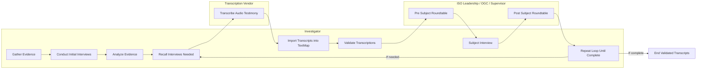

```mermaid
flowchart LR
    %% Investigator Lane
    subgraph INVESTIGATOR["Investigator"]
        A1[Gather Evidence]
        A2[Conduct Initial Interviews]
        A3[Analyze Evidence]
        A4[Recall Interviews Needed]
        A5[Import Transcripts into TextMap]
        A6[Validate Transcriptions]
        A7[Subject Interview]
        A8[Repeat Loop Until Complete]
    end

    %% Leadership Lane
    subgraph LEAD["ISO Leadership / OGC / Supervisor"]
        B1[Pre Subject Roundtable]
        B2[Post Subject Roundtable]
    end

    %% Transcription Vendor Lane
    subgraph VENDOR["Transcription Vendor"]
        C1[Transcribe Audio Testimony]
    end

    %% Flow Connections
    A1 --> A2 --> A3 --> A4
    A4 --> C1 --> A5 --> A6 --> B1 --> A7 --> B2 --> A8
    A8 -->|If needed| A4
    A8 -->|If complete| Z[End Validated Transcripts]
```
